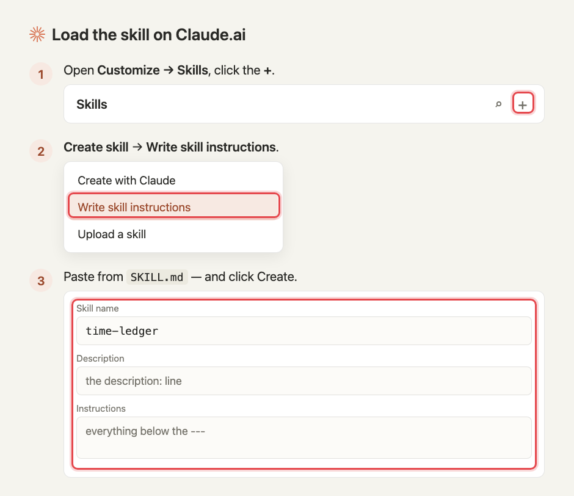
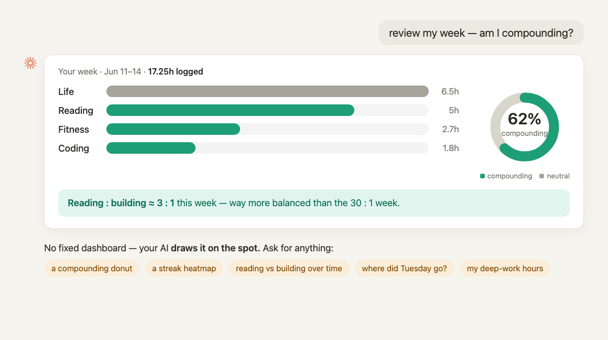

# time-ledger

**English** | [简体中文](README.zh-CN.md)

**Track your time in one sentence.** You say what you did in plain language — *"read ML papers for two hours, hit the gym for one, did a LeetCode problem"* — and an AI parses it into structured activity / minutes / date and writes it to your own Notion database. **When it isn't sure, it asks you back instead of guessing.**

Not a timer. Not a form. A mirror for whether your hours are actually compounding.

```
You:  read ML system design for two hours, gym for one, did a leetcode
AI:   Logged 3 entries ✅
      · Reading · ML system design · 120min · compounding
      · Fitness · gym · 60min
      · LeetCode · ~20min ❓ to-confirm: you didn't say how long — I guessed 20min, right?
```

## Why

I'm lazy — I won't keep a form going — but I do want to know where my time goes: am I wasting it, or compounding it?

Here's what actually changed for me: I'm already in an AI chat for hours a day. So logging isn't a new habit to build — it's one more sentence in a conversation I'm already having. **Zero friction, because it rides a habit I already have** — which is exactly why it sticks where timers and forms die in three days.

And the point isn't the log — it's **compounding**. Once you can see where the hours actually go, you can steer them toward the work that builds on itself. The skill does the grunt work (categorize, estimate, write the row), and when it's unsure it asks instead of guessing — a log that quietly invents facts is worse than none.

## What it is

A **Claude skill** (a single `SKILL.md` of instructions) + your own **Notion database**. No server, no backend to deploy. Capture anywhere you have **Claude or ChatGPT** (phone / laptop / chat); your Notion is the source of truth (cloud, phone-native). **Heads up:** the skill / connector setup currently runs only on the **paid** tiers of Claude and ChatGPT.

## Install

**Step 0 — duplicate the Notion template** (same for both forms): [🇬🇧 English](https://spiral-jump-106.notion.site/0d3d3d13164241f595aa50679c6c42d8) · [🇨🇳 中文](https://spiral-jump-106.notion.site/c7e8fde1248f4b4a9b204ccca99c153f). One click; fields, views, and example rows included.

Then pick your form — both do the same thing, just a different surface:

<table>
<tr>
<th width="50%">⌨️ Terminal · Claude Code</th>
<th width="50%">💬 Web · Claude.ai</th>
</tr>
<tr>
<td width="50%"></td>
<td width="50%"></td>
</tr>
<tr>
<td width="50%" valign="top">

1. Clone the repo and drop `SKILL.md` into `~/.claude/skills/time-ledger/` — **commands below ↓**
2. Add the **Notion MCP connector** (grant your `time-ledger` DB), then restart Claude Code.
3. Log: `claude -p "log it: read papers 2h today"`

</td>
<td width="50%" valign="top">

1. **Settings → Capabilities** → turn on **Code execution and file creation** (*"Required for skills"*).
2. **[claude.ai/customize/skills](https://claude.ai/customize/skills)** → **+** → Create skill → **Write skill instructions** — paste the name, description, and body from **[`SKILL.md`](./SKILL.md)**.
3. **Settings → Connectors → Notion** — grant access to your `time-ledger` database.
4. Just say *"log it: read papers 2h today."*

*Also works in **ChatGPT** (paid) — connect the Notion connector and paste these instructions into a Custom GPT. No skill upload, so a touch more setup.*

</td>
</tr>
</table>

**Where to click — Claude.ai & ChatGPT** (each step red-boxed; the ChatGPT side needs a paid plan):



**Claude Code commands** (中文 → swap `SKILL.md` for `SKILL.zh-CN.md`):

```bash
git clone https://github.com/cruisekkk/time-ledger.git
mkdir -p ~/.claude/skills/time-ledger
cp time-ledger/SKILL.md ~/.claude/skills/time-ledger/SKILL.md
```

**Either way — no id to paste.** The skill finds your database by title (keep `time-ledger` / `时间账本` in it, and share just that one), reads its id, and writes the row — asking instead of guessing when it's unsure. (On Claude.ai the first write pops an **approve** prompt — Notion's write tools default to *Needs approval* — so it's expected, not a hang.)

> **Customize** — want different categories or another language? Change the fields in your database, then mirror them in the skill's instructions (the select values must match).

## Usage

- **Just report**: say what you did → the AI parses and writes it, batch-asking on anything uncertain.
- **Batch reconcile**: say *"tidy up my time ledger"* → the AI pulls every `待确认` (to-confirm) row and asks you in one message, then fills them in.
- **See the breakdown**: Notion's built-in calendar view + group-by-activity sum; or ask your AI to draw a chart on the spot.

**Review it with your AI — no fixed dashboard.** Ask *"how did my week go — am I compounding?"* and it generates the view live: bars, a compounding donut, a streak heatmap, a reading-vs-building ratio — whatever you ask for.



## Honest limitations

- You have to actually report — it doesn't auto-track (on purpose; a tracker doesn't know *why* you spent the time).
- The `compounding / consuming / neutral` tags are hand-rules today, not learned — a real engine is roadmap, not repo.
- n=1: used solo for a handful of days, no real validation.

## Design philosophy

From a larger personal project (inveself), one line: **"You have to become a compounding *person* before you can be a good compounding *investor*."** This ledger is the tool for that line — it honestly mirrors whether your hours compound (it once showed the author a week of reading:building ≈ 30:1).

## License

MIT — see [LICENSE](./LICENSE). Fork it, use it, ship your own version.
